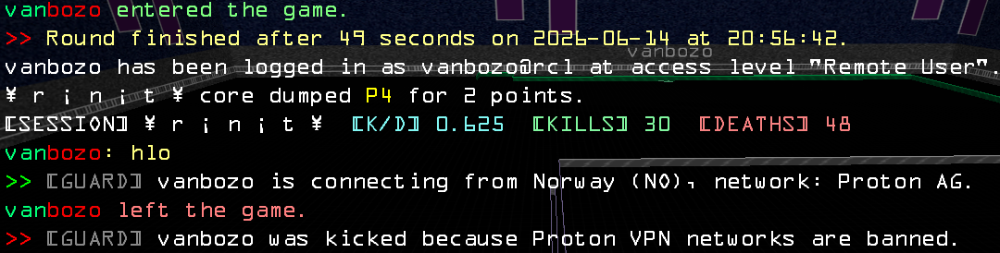

# AA Guard


AA Guard monitors ladderlog input and dispatches server commands with precision.
A lightweight, self-contained solution, no external PHP packages, designed for continuous pipe operation.

## How It Works

Player joins → Guard reads event → Guard queries IP at ipinfo.io → Guard resolves network and country → Guard emits join notification (optional) → Guard matches network against regex rules → Guard executes action templates if matched.

## Features

- **Non-blocking I/O**: Reads `STDIN` line-by-line using `stream_select` for efficient event handling.
- **Clean output**: Writes commands to `STDOUT` and flushes immediately; logs to `STDERR` with severity (`DEBUG`, `WARN`, `ERROR`).
- **Event handling**: Processes `PLAYER_ENTERED_GRID`, `PLAYER_ENTERED_SPECTATOR`, `PLAYER_RENAMED`, `PLAYER_LEFT`, and `INVALID_COMMAND` ladderlog events, including arguments containing spaces.
- **IP validation**: Validates IPv4 format before processing; rejects private and reserved ranges.
- **GeoIP lookup**: Queries ipinfo.io for network name, country code, country name, and IANA timezone; supports Bearer token authentication.
- **Intelligent caching**: In-memory IP cache (`cacheTtlSeconds`) minimises redundant API calls.
- **Rate limiting**: Local per-minute rate limiting for API calls; respects ipinfo.io backoff signals.
- **Retry mechanism**: Configurable retry queue with custom delays (`retry.delaysMs`) for resilience under load.
- **Action deduplication**: Reduces repeated enforcement using configurable dedupe window (`dedupeWindowSeconds`).
- **Regex matching**: Compares network names against user-defined rules (`rules[].pattern`) with validation at startup.
- **Action templates**: Supports lifecycle hooks:
  - Startup actions (`actions.onStartup`)
  - Join notifications (`actions.onConnect`, custom message via `actions.onConnectMessage`)
  - Rule match responses (`actions.onMatch`)
  - Periodic metrics reports (`actions.onMetrics`)
  - Debug forwarding (`actions.onDebug`, when `debug=true`)
- **Admin notifications**: Guarantees per-admin join messages even if the configuration lacks `{{admin}}` template.
- **Comprehensive metrics**: Tracks bans, lookups, cache hits, live cache size, API errors, rate-limited events, invalid IPs, and runtime.
- **Metrics on demand**: Periodic reports (`metricsIntervalSeconds`, `0` to disable) or manual trigger via `SIGUSR1`.
- **Remote control**: Supports admin/mod remote commands such as `/guard metrics` and `/guard players`, replying only to the requesting user.
- **Online player register**: Records `player_id`, `player_name`, `player_country`, and `player_network` on join; updates tracked identity on `PLAYER_RENAMED`; removes player from list on `PLAYER_LEFT`.
- **Graceful lifecycle**: Responds to `SIGTERM` and `SIGINT`; stops cleanly when `STDIN` closes.

## In-Action

- Issued matched action with `onConnect` message (red prefix is public, green is private)


- Issued metrics action


## Requirements

- PHP 8.1 or later
- Outbound HTTPS access to ipinfo.io
- Armagetron server with `ladderlog.txt` support (version at least 0.2.8-sty or 0.4)

Typical server pipeline:

```sh
tail -fn0 -s0.01 /path/to/commands_file | $armagetron-dedicated | tee -a /path/to/console_log
```

## Getting Started

**With default configuration:**

```sh
tail -fn0 -s0.01 /path/to/server_ladderlog | php /path/to/aa-guard/bin/aa_guard.php | tee -a /path/to/commands_file
```

**With custom configuration directory:**

```sh
tail -fn0 -s0.01 /path/to/server_ladderlog | php /path/to/aa-guard/bin/aa_guard.php /path/to/config_dir | tee -a /path/to/commands_file
```

**Detached process with authentication token:**

```sh
IPINFO_TOKEN="your_token" screen -dmS aa-guard sh -c 'tail -fn0 -s0.01 /path/to/server_ladderlog | php /path/to/aa-guard/bin/aa_guard.php /path/to/config_dir | tee -a /path/to/commands_file'
```

## Signal Handling

- `SIGTERM`: Terminate gracefully
- `SIGINT`: Interrupt gracefully
- `SIGUSR1`: Emit metrics immediately (requires `pcntl` extension)

## Remote Control

AA Guard can react to `INVALID_COMMAND` ladderlog lines emitted by the server when players type commands such as:

```text
/guard metrics
/guard players
```

Currently supported remote command:

- `/guard metrics` — emits the current guard metrics only to the requesting user
- `/guard players` — emits currently tracked online players only to the requesting user

Authorization rules:

- users listed in `admins`
- moderators/admins with `player_level >= 2` (`player_level` is the ladderlog-reported server permission level)

Unauthorized or unknown remote commands are silently ignored for now.

## Configuration

Configuration files reside in `config/` by default:

- `config/general.json`: Core settings
- `config/rules.json`: Matching rules
- `config/actions.json`: Action templates

Legacy single-file configuration remains supported if a JSON file path is provided explicitly.

### `general.json` Settings

| Key | Type | Required | Default | Purpose |
|-----|------|----------|---------|---------|
| `admins` | array | Yes | – | Administrator usernames for notifications |
| `retry.maxAttempts` | int | Yes | – | Maximum number of retry attempts for failed lookups |
| `retry.delaysMs` | int | Yes | – | Delay (ms) between each retry attempt |
| `cacheTtlSeconds` | int | No | `1800` | IP cache lifetime in seconds |
| `dedupeWindowSeconds` | int | No | `15` | Deduplication window for repeated matches |
| `ipInfoTimeoutSeconds` | int | No | `2` | API request timeout in seconds |
| `ipInfoRateLimitPerMinute` | int | No | `30` | Maximum API calls per minute |
| `metricsIntervalSeconds` | int | No | `0` | Periodic metrics report interval (`0` = disabled) |
| `debug` | bool | No | `false` | Enable debug logging and forwarding |

### `actions.json` Settings

| Key | Type | Required | Purpose |
|-----|------|----------|---------|
| `onStartup` | array | Yes | Commands executed once at startup, including ladderlog subscriptions such as `LADDERLOG_WRITE_PLAYER_ENTERED_GRID 1`, `LADDERLOG_WRITE_PLAYER_ENTERED_SPECTATOR 1`, `LADDERLOG_WRITE_PLAYER_RENAMED 1`, `LADDERLOG_WRITE_PLAYER_LEFT 1`, and `LADDERLOG_WRITE_INVALID_COMMAND 1` |
| `onDebug` | array | Yes | Debug message templates (emitted when `debug=true`; once per admin per event) |
| `onConnectMessage` | string | Yes | Template for join message (`{{msg}}` placeholder; uses `player_id`, `country_name`, `country_code`, `network_name`) |
| `onConnect` | array | Yes | Action templates for each player join (may reference `{{msg}}`) |
| `onMatch` | array | Yes | Action templates when a network matches a rule |
| `onMetrics` | array | No | Metrics report templates (emitted periodically or on `SIGUSR1`) |

### `rules.json` Structure

An array of rule objects; each item contains:

| Field | Type | Purpose |
|-------|------|---------|
| `name` | string | Human-readable rule identifier |
| `pattern` | string | PCRE-compatible regex for network name matching |

## Templates and Placeholders

### `actions.onConnectMessage`

Rendered before `onConnect` templates; generates the `{{msg}}` placeholder.

**Available placeholders:**
- `{{player_id}}` – Player identifier
- `{{country_name}}` – Full country name
- `{{country_code}}` – ISO 3166-1 alpha-2 code
- `{{network_name}}` – ASN name from ipinfo.io
- `{{time}}` – Player's local time (`HH:MM`), derived from the IANA timezone reported by ipinfo.io for their IP; `unknown` if the timezone is unavailable or invalid

**Example:**  
`"{{player_id}} is connecting from {{country_name}} ({{country_code}}), network: {{network_name}}, time={{time}}."`

### `actions.onConnect`

Executed for each player join.

**Available placeholders:**
- `{{msg}}` – Pre-rendered join message (from `onConnectMessage`)
- `{{player_id}}` – Player identifier
- `{{country_name}}` – Country name (full)
- `{{country_code}}` – Country code (ISO 3166-1 alpha-2)
- `{{network_name}}` – Network/ASN name
- `{{time}}` – Player's local time (`HH:MM`), derived from the IANA timezone reported by ipinfo.io for their IP; `unknown` if the timezone is unavailable or invalid
- `{{admin}}` – Admin username (only in admin-targeted templates)

**Behaviour:**
- Templates with `{{admin}}` are emitted once per admin in the `admins` array.
- Templates without `{{admin}}` are emitted once per join.
- If no admin-targeted template is present, the guard automatically sends: `PLAYER_MESSAGE {{admin}} "{{msg}}"`

### `actions.onMatch`

Executed when a network matches a rule.

**Available placeholders:**
- `{{player_id}}` – Player identifier
- `{{display_name}}` – Player display name
- `{{ip}}` – IPv4 address
- `{{country}}` – Country code
- `{{network_name}}` – Network/ASN name
- `{{rule_name}}` – Matched rule name

### `actions.onMetrics`

Emitted periodically, on demand (`SIGUSR1`), or in response to `/guard metrics`.

For periodic and `SIGUSR1` reports, templates are emitted only to admins currently present in the tracked online player list. Absent admins do not receive `onMetrics` output.

**Available placeholders:**
- `{{admin}}` – Admin username
- `{{bans}}` – Total enforcement actions
- `{{lookups}}` – Total IP lookups
- `{{cache_hits}}` – Cache hits
- `{{cache_size}}` – Current in-memory cache entries
- `{{api_errors}}` – API errors
- `{{rate_limited}}` – Rate limit events
- `{{invalid_ips}}` – Invalid IP addresses rejected
- `{{last_action_who}}` – Last enforced player identifier
- `{{last_action_why}}` – Last enforcement reason (matched rule name)
- `{{runtime}}` – Formatted runtime duration

`last_action_who` and `last_action_why` are available before `runtime` in the default metrics template.

### `/guard players` Response Format

Each tracked online player is sent as a dedicated `PLAYER_MESSAGE` line to the requester.

`PLAYER_RENAMED` events move tracked entry from old `player_id` to new `player_id` and update `player_name` from ladderlog screen name field.

Fields per line:

- `player_id`
- `player_name`
- `player_country`
- `player_network`
- `time` – Player's local time (`HH:MM`), derived from the IANA timezone reported by ipinfo.io for their IP at join time; `unknown` if the timezone is unavailable or invalid

If no players are tracked, guard replies with `No tracked players online.`

### `actions.onDebug`

Debug logging templates (emitted only when `debug=true`).

Placeholders are optional; typically static commands.

## Full Example Config

```json
{
  "actions": {
    "onStartup": [
      "CONSOLE_MESSAGE 0xff0000>> 0x888888[GUARD] 0xffffff AA guard started",
      "LADDERLOG_WRITE_PLAYER_ENTERED_GRID 1",
      "LADDERLOG_WRITE_PLAYER_LEFT 1",
      "LADDERLOG_WRITE_INVALID_COMMAND 1"
    ],
    "onDebug": [
      "PLAYER_MESSAGE {{admin}} \"0xff0000>> 0x888888[GUARD] 0xffffff [{{level}}] {{msg}}\""
    ],
    "onConnectMessage": "{{player_id}} is connecting from {{country_name}} ({{country_code}}), network: {{network_name}}, time={{time}}.",
    "onConnect": [
      "# CONSOLE_MESSAGE 0xff0000>> 0x888888[GUARD] 0xffffff{{player_id}} is connecting from {{country_name}} ({{country_code}}).",
      "PLAYER_MESSAGE {{admin}} \"0xff0000>> 0x888888[GUARD] 0xffffff {{msg}}\""
    ],
    "onMatch": [
      "KICK {{player_id}} Your network is banned.",
      "CONSOLE_MESSAGE 0xff0000>> 0x888888[GUARD] 0xffffff {{player_id}} was kicked because {{rule_name}} networks are banned."
    ],
    "onMetrics": [
      "PLAYER_MESSAGE {{admin}} \"0xff0000>> 0x888888[GUARD] 0xffffff bans={{bans}} lookups={{lookups}} cacheHits={{cache_hits}} cacheSize={{cache_size}} apiErrors={{api_errors}} rateLimited={{rate_limited}} invalidIps={{invalid_ips}} lastActionWho={{last_action_who}} lastActionWhy={{last_action_why}} runtime={{runtime}}\""
    ]
  },
  "admins": [
    "admin_1",
    "admin_2"
  ],
  "rules": [
    {
      "name": "vpn",
      "pattern": "/vpn/i"
    }
  ],
  "retry": {
    "maxAttempts": 3,
    "delaysMs": [250, 750, 1500]
  },
  "cacheTtlSeconds": 604800,
  "dedupeWindowSeconds": 15,
  "ipInfoTimeoutSeconds": 2,
  "ipInfoRateLimitPerMinute": 30,
  "metricsIntervalSeconds": 300,
  "debug": false
}
```

## Default Join Message Format

```
<player_id> is connecting from <country_name> (<country_code>), network: <network_name>, time=<HH:MM>.
```

`<HH:MM>` reflects the player's own local time (from their IP's IANA timezone via ipinfo.io). If the timezone can't be determined, `<HH:MM>` is `unknown` — the guard never substitutes its own server clock.

## Expected Ladderlog Format

```
PLAYER_ENTERED_GRID player_1 192.168.51.42 Player 1
PLAYER_ENTERED_SPECTATOR player_2 192.168.51.43 Player 2
PLAYER_RENAMED player_1 player_1@clan 192.168.51.42 1 Player 1
PLAYER_LEFT player_1 192.168.51.42 Player 1
INVALID_COMMAND guard admin_1 192.168.51.42 2 metrics
INVALID_COMMAND guard admin_1 192.168.51.42 2 players
```

## Important Notes

- The configuration loader exits with code `2` if a required field is missing or invalid.
- The guard exits with code `1` if `stream_select` fails (critical I/O error).
- IP lookups reject private and reserved ranges (`private_ip` error); no internal addresses are queried.
- Invalid IPv4 addresses are rejected early and counted in the `invalid_ips` metric.
- Deduplication is keyed on `playerId|ruleName` to prevent repeated enforcement.
- Startup actions enable `LADDERLOG_WRITE_PLAYER_ENTERED_GRID 1`, `LADDERLOG_WRITE_PLAYER_ENTERED_SPECTATOR 1`, `LADDERLOG_WRITE_PLAYER_RENAMED 1`, `LADDERLOG_WRITE_PLAYER_LEFT 1`, and `LADDERLOG_WRITE_INVALID_COMMAND 1` in the default configuration.
- Remote `/guard metrics` and `/guard players` requests are authorized for configured admins and users with level `2` or higher, and replies are sent only to the requester.
- Online players are tracked by join/rename/leave events and exposed through `/guard players` with fields: `player_id`, `player_name`, `player_country`, `player_network`, `time` (player's own local time `HH:MM`, from ipinfo.io timezone data, or `unknown`).
- `{{time}}` reflects each player's own local time, computed from the IANA timezone (e.g. `Europe/Warsaw`) that ipinfo.io reports for their IP. If the timezone is missing or invalid, `{{time}}` is `unknown` — it never falls back to the guard process's own server clock. Available in `onConnectMessage`, `onConnect`, and the `/guard players` report.
- Metrics include last enforcement details via `last_action_who` and `last_action_why` before `runtime`.
- No external package managers or dependencies are required, PHP standard library only.
- **Retry mechanism:** Triggered by lookup failures or rate limits. Configured delays (`retry.delaysMs`) apply to lookup retries; rate limiting respects ipinfo.io's backoff signals instead.
- **Value sanitisation:** Template values like `{{player_id}}` are sanitised (alphanumeric, spaces, slashes, dashes, dots, underscores, @); `{{msg}}` in quoted contexts uses proper shell escaping (`\"` and `\\`).
- **Admin-targeted actions:** Templates containing `{{admin}}` are emitted once per administrator; useful for debug logs, metrics, and personalised notifications.

## Performance Benchmarking

The repository includes a reproducible synthetic benchmark at `benchmarks/perf_footprint.php`.

Run:

```sh
php benchmarks/perf_footprint.php
```

The benchmark focuses on the two hottest maintenance paths under load:

- `guard_housekeeping`: repeated cleanup of large in-memory caches.
- `ipinfo_rate_limit_prune`: repeated pruning of rate-limit timestamps.

### Latest Local Measurement (2026-06-13, PHP 8.4.21, Linux)

| Scenario | Before (s) | After (s) | Improvement | Peak memory before | Peak memory after |
|---|---:|---:|---:|---:|---:|
| `guard_housekeeping` | 9.3785 | 0.0059 | 99.94% faster | 18,874,368 B | 18,874,368 B |
| `ipinfo_rate_limit_prune` | 5.0232 | 0.0015 | 99.97% faster | 18,874,368 B | 16,777,216 B |

Raw benchmark snapshots are stored in:

- `benchmarks/before.json`
- `benchmarks/after.json`

These numbers are workload- and machine-specific; use the script above to validate on your host.

---

```text
Keep the server tidy, keep the grid fair, keep the logs forthright.
```
